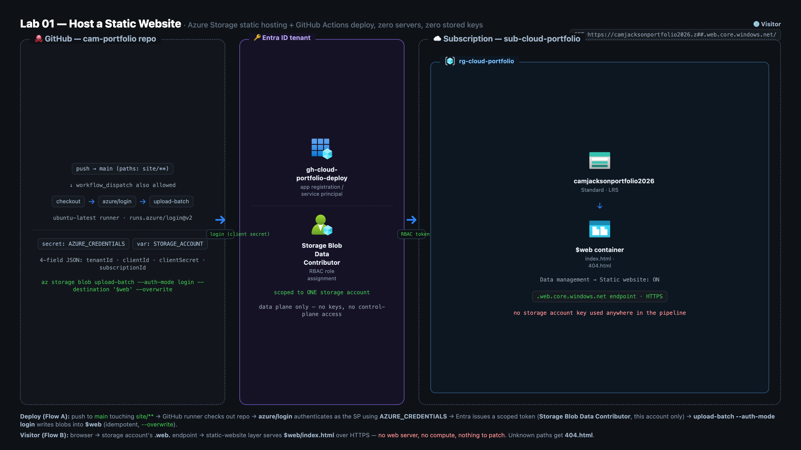

# Cameron Jackson | Resume Site

Personal resume site for **Cameron Jackson**: cloud infrastructure, automation, and recorded lab builds.

🔗 **Live:** https://camdjackson.com/projects.html
📺 **Build walkthrough (Lab 1):** https://youtu.be/qB_ZlxVeEj0

Static **HTML / CSS / vanilla JS**, no build step, no framework, no web server. Hosted on **Azure Storage static website hosting** and auto-deployed by **GitHub Actions** on every push to `main`. This repository is the artifact of **Lab 1**: the entire hosting + deploy setup was built on camera.

## Architecture



**Deploy flow:** push to `main` touching `site/**` → GitHub runner checks out the repo → `azure/login` authenticates as a dedicated service principal → Entra ID issues a scoped token → `az storage blob upload-batch --auth-mode login` writes the site into the `$web` container. Idempotent, ~30 seconds.

**Visitor flow:** browser → `camdjackson.com` → Azure Storage's static-website endpoint serves `index.html` over HTTPS. No web server, no compute, nothing to patch.

## What's deployed

| Piece | Value |
|---|---|
| Hosting | Azure Storage static website (`$web` container), Standard · LRS |
| Deploy identity | `gh-cloud-portfolio-deploy` service principal |
| Its only permission | **Storage Blob Data Contributor**, scoped to this one storage account, data plane only |
| Pipeline | `.github/workflows/deploy.yml`, actions pinned to commit SHAs |
| Domain | `camdjackson.com` (Cloudflare in front of the Azure endpoint) |

## Security posture

- **No storage account keys anywhere in the pipeline.** Uploads use `--auth-mode login` with an RBAC-scoped identity.
- The deploy principal can touch exactly one storage account's data plane; it has no control-plane or subscription access.
- Workflow actions are **pinned to full commit SHAs**, not movable version tags.
- The service principal credential shown during the recorded build has been **rotated** since filming.

**Named trade:** the pipeline authenticates with a client secret (`AZURE_CREDENTIALS`). The next step is **OIDC / workload identity federation**, which removes the stored secret entirely. That migration is on the roadmap.

## Structure

```
.github/workflows/deploy.yml   # CI/CD: uploads site/src → $web on push to main
site/src/                      # everything here is published
├── index.html                 # home
├── projects.html              # lab/project cards
├── resume.html                # renders the résumé (also the PDF source)
└── css/ · js/ · img/
```
