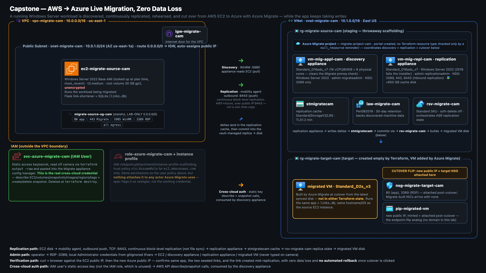
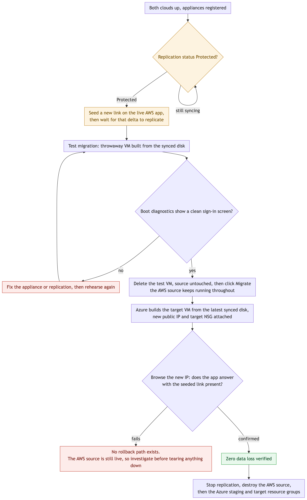

# Capstone - AWS EC2 → Azure migration (Azure Migrate lift-and-shift)

A live Windows Server workload on AWS EC2 moves to Azure with Azure Migrate -
agentless discovery, continuous block-level replication, a rehearsed test
migration, and a real cutover - with a scripted proof that nothing written
during the move is lost.

## Architecture



AWS on the left, Azure on the right, in migration order. The source is a Windows Server 2022
EC2 instance in a public subnet running the app and its SQLite database, and the credential
that actually crosses the cloud boundary is the `svc-azure-migrate-cam` IAM user's static key,
not the IAM role sitting beside it. On the Azure side a staging resource group holds the
discovery and replication appliances, the replication cache storage account, Log Analytics and
the Recovery Services Vault, while the target resource group is created empty by Terraform and
the migrated VM is added by Azure Migrate itself, tracked by neither Terraform state.

## How it runs



Replication has to reach Protected before anything else happens, and while it
is still streaming a new link is written on the live AWS app as the delta
that has to survive the move. A rehearsed test migration boots a throwaway
VM and loops back on a failed boot-diagnostics check instead of proceeding;
only a clean boot clears the way to the real cutover, which builds the
target VM and flips a new public IP and NSG onto it. Verification is a
manual browse of that new IP confirming the app, the original links, and the
seeded new link are all present - there is no automated rollback if that
check fails, because the only safety net is the test migration rehearsal
that already ran, so a failure here means investigating in place with the
AWS source still live, not reverting.

## What is here

```
assets/
  aws-terraform/     # the SOURCE cloud - VPC, IAM for Migrate, EC2 running the app
  azure-terraform/   # the TARGET cloud - landing zone + Migrate scaffolding + appliances
  cutover-runbook.md # the ordered discovery->assess->replicate->test->cutover sequence
  README.md          # this file
```

## Deploy order

1. **AWS creds off camera:** `aws configure` → confirm `aws sts get-caller-identity`.
2. **Azure creds off camera:** `az login` → confirm `az account show` is the right sub.
3. **AWS side:**
   ```
   cd aws-terraform
   cp terraform.tfvars.example terraform.tfvars   # set admin_password
   terraform init && terraform apply              # ~10 resources
   ```
   Wait ~5 min after apply for Windows to finish first boot, then browse
   `http://$(terraform output -raw ec2_public_ip)` - the app should answer.
4. **Azure landing zone:**
   ```
   cd ../azure-terraform
   cp terraform.tfvars.example terraform.tfvars   # set both appliance passwords
   terraform init && terraform apply              # landing zone + Migrate scaffolding
   ```
5. **Create the Azure Migrate project** in the portal (see `migrate.tf` comment).
6. **Discovery appliance:** `mv appliances-discovery.tf.later appliances-discovery.tf && terraform apply`.
   RDP in, install/register the appliance, add the AWS service-account creds
   (OFF CAMERA), start discovery.
7. **Assess** the discovered EC2 instance in the portal.
8. **Replication appliance:** `mv appliances-replication.tf.later appliances-replication.tf && terraform apply`.
   Register with the vault, enable replication, wait for **Protected**.
9. **Test migration → cutover → validate** - see `cutover-runbook.md`.

## Staging the appliances (the `.tf.later` trick)

Terraform only reads `*.tf`. The two appliance files ship as `*.tf.later` so
the landing-zone apply is clean, and each appliance is revealed on camera with a
single `mv` (no live typing, clean cut) exactly when the migration needs it.

## Credential handling (READ THIS)

- `aws configure` and `az login` happen **off camera**. No key ever appears on screen.
- The AWS service-account key/secret (`terraform output -raw migrate_access_key_id`
  / `migrate_secret_access_key`) get pasted into the Migrate appliance **off
  camera**; blur any frame that shows them.
- The three passwords (`admin_password`, `appliance_admin_password`,
  `replication_admin_password`) live only in gitignored `terraform.tfvars`.
- All of this is plaintext-for-a-lab and gets **rotated or torn down same day**.

## Cost window (~$12-18/day, tear down BOTH clouds same day)

| Resource | ~Cost |
|--|--|
| EC2 t3.medium (Windows) | ~$0.08/hr |
| Azure discovery appliance (D16ads_v7) | ~$1.00/hr |
| Azure replication appliance (D16ads_v7, + ~600 GB cache disk) | ~$1.00/hr |
| Azure Storage (replication cache, ~30 GB) | ~$0.60/day |
| Azure target VM (B2s, post-cutover) | ~$0.05/hr |
| **Full-day lab** | **~$12-18** |

The two D16ads_v7 appliances are the drivers (the replication one also carries a
~600 GB cache data disk) - budget the window, run it in one sitting, and destroy
everything the same day.

## Teardown - BOTH clouds

**Azure Migrate → Stop replication FIRST**, then:

```
cd aws-terraform   && terraform destroy      # source EC2 + IAM + VPC
cd ../azure-terraform && terraform destroy    # staging RG, both appliances, storage, vault
az group delete -name rg-migrate-target-cam -yes   # migrated VM (built by Migrate, not TF)
```

Never touch `rg-cloud-portfolio` (the live site + resume).

## Deviations from the assignment PDF

- **App on the source box.** The PDF migrates a bare Windows Server; we install
  the link-shortener + seeded SQLite via user_data so the cutover proves "same
  app, same data, new cloud." The migration mechanism is unchanged - a disk is a
  disk.
- **Port 80 opened** on the source SG and the target NSG so the app is browsable
  (PDF opened only 443/3389/RDP).
- **`yourname = cam`** (PDF example used "charles"); **Azure region East US**
  paired with **AWS us-east-1** (the other labs use West US 2 - here we follow
  the PDF's "region close to your AWS region" rule).
- **Split Terraform files** (network / migrate / appliances) and the `.tf.later`
  staging for the appliances - the PDF keeps one main.tf and edits it in place.
