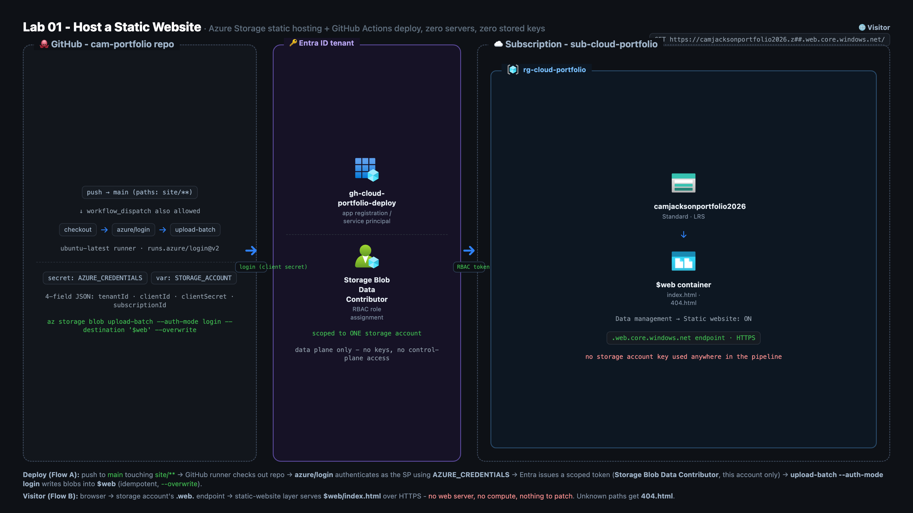
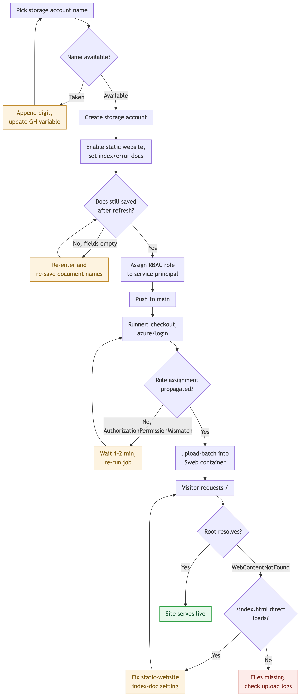

# Lab 01 assets

**Lab 01's artifact is this repository itself.** There is no separate copy of the code
here, because the pipeline built on camera is the one that actually deploys the site.

The two pieces that make up the lab are live at:

| Path | What it is |
|---|---|
| `.github/workflows/deploy.yml` | The GitHub Actions pipeline. Runs on every push to `main` that touches `site/**`, logs in to Azure as a service principal, and uploads the site to the `$web` container. |
| `site/src/` | The static site it deploys. Plain HTML, CSS and vanilla JS. No build step, no framework, no web server. |

They are not duplicated into this folder on purpose. The workflow's trigger and its
`--source` argument are wired to those exact paths, so a second copy would either drift
out of date or break the deploy.

## Architecture

Three zones. GitHub holds the site source and the workflow, Entra ID holds the app
registration and the service principal the workflow signs in as, and the Azure subscription
holds the resource group and the storage account whose built-in static website feature serves
the `$web` container over HTTPS. There is no web server and no compute anywhere in the path,
and the service principal's role assignment is scoped to that one storage account.

## How it runs

A push to `main` that touches the site triggers the workflow, which signs in and uploads the
files into `$web`. The branches in the chart are the ones that actually bite: a storage
account name already taken, an index document that did not save, an RBAC assignment that has
not propagated yet so the first deploy fails on an authorization mismatch, and a root URL
returning 404 where the diagnosis splits on whether `/index.html` loads directly.

## What the build actually does

**Azure Storage static website hosting.** A storage account with the static website
feature enabled, which exposes a `$web` container over HTTPS with an index document and
a 404 document. No virtual machine and no web server process.

**Deploy on push, with no stored keys.** The workflow authenticates as a service
principal and uploads with `--auth-mode login`, so authorization goes through Entra ID
and RBAC. No storage account access key exists in the repository or in CI.

**Least privilege.** The service principal holds Storage Blob Data Contributor scoped to
the single storage account, not to the subscription or the resource group.

**Actions pinned by commit SHA.** `actions/checkout` and `azure/login` are pinned to
immutable SHAs rather than floating tags, so a compromised or retagged release cannot
change what runs in the pipeline.

## Setup performed once, by hand

These steps were done on camera and are not in any script, since they run once per
account rather than on every deploy:

1. Create the resource group and the storage account.
2. Enable static website hosting on the account, setting the index and error documents.
3. Create a service principal for the pipeline.
4. Assign it Storage Blob Data Contributor, scoped to that storage account only.
5. Store the credential as the `AZURE_CREDENTIALS` repository secret, and the account
   name as the `STORAGE_ACCOUNT` repository variable.

Both names appear in `deploy.yml`. The values do not; GitHub resolves them at run time.

## Video walkthrough

https://youtu.be/qB_ZlxVeEj0
