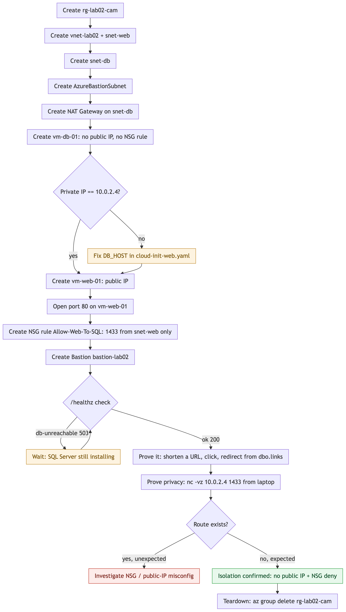

# Lab 02 - build assets

A public link-shortener web tier and a private SQL Server database sit in one VNet, with the
database reachable only through an NSG rule and administered only through a managed Bastion host.

## Architecture


Everything sits inside resource group `rg-lab02-cam`, split into three subnets of one VNet.
`snet-web` holds `vm-web-01`, which takes a public IP and runs nginx in front of gunicorn and
Flask, the only way in from the internet. `snet-db` holds `vm-db-01`, which has no public IP at
all; its NSG allows inbound 1433 from `snet-web` only, so the SQL Server instance is reachable
from nowhere else. `natgw-lab02` gives that same subnet outbound-only internet so cloud-init can
install SQL Server, and a separate `AzureBastionSubnet` holds the managed Bastion host an operator
uses to reach `vm-db-01` over HTTPS, since no SSH port is ever opened to the internet.

## How it runs



The network and NAT Gateway are created before the database VM so cloud-init has an outbound
route the moment it boots, and the NSG rule that scopes port 1433 to the web subnet is created
only after both VMs exist. Once `/healthz` reports the app can reach the database, the lab is
proven two ways: shortening and clicking a link shows a live read against the private database,
and running `nc -vz` at the database's private IP from a laptop times out, confirming there is no
route in from outside the VNet.

**This lab is also the Linux-administration receipt.** Nothing here is portal magic:
both VMs are Ubuntu administered the standard way - packages installed and services
wired by cloud-init, the app run as a **systemd unit**, **nginx** as the reverse proxy,
env config in `/etc/app.env`, and debugging done by chasing logs
(`/var/log/cloud-init-output.log`, `journalctl -u`, nginx logs) over Bastion SSH.
When talking about this lab, say the Linux part out loud - "systemd service, nginx
reverse proxy, cloud-init provisioning, log-first debugging" - it's the proof line
for Linux fundamentals, not just Azure networking.

## What is here
- `cloud-init-db.yaml` - vm-db-01: SQL Server 2022 Express, least-priv `appuser`,
  seeded `dbo.links` table.
- `cloud-init-web.yaml` - vm-web-01: nginx → gunicorn → Flask link shortener (app embedded).
- `app/app.py`, `app/templates/index.html` - canonical, readable copy of the app for
  the code-walk. **Embedded into `cloud-init-web.yaml`** - if you edit one, edit both.

## Deploy order (matches the shoot)
1. VNet + two subnets (per the PDF).
2. **NAT Gateway on snet-db, before the DB VM** - `natgw-lab02` + `pip-natgw`, attached to
   `snet-db`. snet-db has no public IP anywhere and this subscription's subnets get no
   default outbound internet access - without it, cloud-init's curl to
   `packages.microsoft.com` never connects and `mssql-server` never installs. Outbound-only,
   so it opens no inbound door. ~$0.045/hr, dies with the RG. (Confirmed missing and required
   live 2026-07-10; also see the Shoot Troubleshooting Log #5.)
3. **vm-db-01** - paste `cloud-init-db.yaml` as Custom data. **Image: Ubuntu Server 22.04
   LTS** (NOT 20.04 - that marketplace image is gone from westus2, and the cloud-init's
   `mssql-server` repo already targets the 22.04 apt feed; a mismatch here is the exit-code-127
   "missing libs" failure). **Size: Standard_D2as_v7** (SQL Server needs ≥2 GB; B1s = 1 GB and
   the install fails - B1s, B2s, and D2s_v3 were all `NotAvailableForSubscription` in westus2 as
   of 2026-07-18). No public IP. Confirm its private IP is `10.0.2.4`; if not, fix `DB_HOST` in
   the web cloud-init.
4. **vm-web-01** - paste `cloud-init-web.yaml`. Ubuntu 22.04, Standard_D2as_v7, public IP, NSG
   allows 80.
5. NSG on the DB: allow `10.0.1.0/24` → `1433`, deny the rest (tighten the PDF's `*`).
6. Browse the web VM's public IP → shorten a URL, click the short link → it redirects.
   That redirect is the web tier reading a row from the private DB (the money shot).

**🔒 Verify live before recording:** VM SKU capacity in a region can vanish for a subscription
with zero notice - `az vm list-skus -location westus2 -size Standard_D2as_v7 -all` and check
for a `Location`-type restriction. Hit this exact wall dry-running 2026-07-18: `Standard_B1s`,
`Standard_B2s`, and `Standard_D2s_v3` were all unavailable; `Standard_D2as_v7` is what both VMs
actually use now.

## Before you paste (the two passwords)
Set the SAME value in both files:
- `cloud-init-db.yaml` → `APP_PASSWORD`
- `cloud-init-web.yaml` → `/etc/app.env` `DB_PASS`
Pick a strong one (SQL Server `CHECK_POLICY=ON` enforces upper+lower+digit+symbol).
`SA_PASSWORD` (db file only) is provisioning-time; the app never uses it.

⚠️ These are plaintext in cloud-init by design for Lab 02 - acknowledge on camera,
**rotate before publish**, and add to Post-deploy housekeeping. Getting the password
off the box is the headline of the hardened version.

## Cleanup - delete ONLY the lab group
When recording stops, delete **`rg-lab02-cam`** (and nothing else):
```
az group delete -name rg-lab02-cam -yes -no-wait
```
This kills every lab resource - VMs, disks, NICs, NSGs, VNet, **Bastion** (the cost
landmine) - in one action. ⚠️ **Never touch `rg-cloud-portfolio`** - that's the live
site + résumé and it stays up permanently. The two groups are isolated; deleting the lab
group cannot reach the site group. (Your résumé source also lives in `site/src/` + GitHub,
so a `git push` always rebuilds the live copy regardless.)

## Verify / debug
- Web up: `curl http://<web-public-ip>/healthz` → `ok` (200). `db-unreachable` (503)
  means the web tier can't reach 1433 on the DB - check the NSG and that
  `cloud-init-db.yaml` finished (`/var/log/db-setup.done` on vm-db-01 via Bastion).
- cloud-init logs on each VM: `/var/log/cloud-init-output.log`.
- Prove privacy: from your laptop, `nc -vz <db-private-ip> 1433` → no route. From the
  web VM (via Bastion) → connects.
