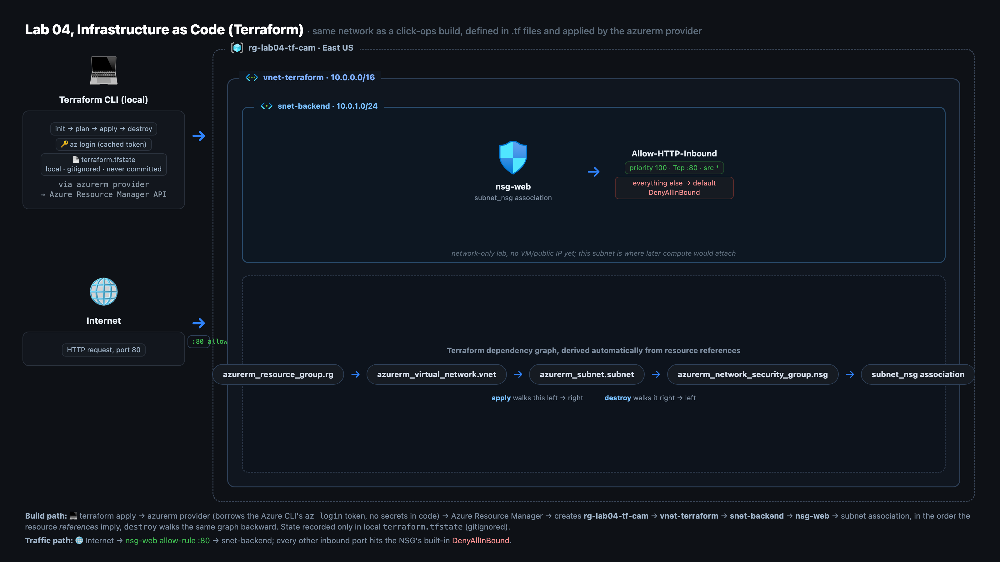
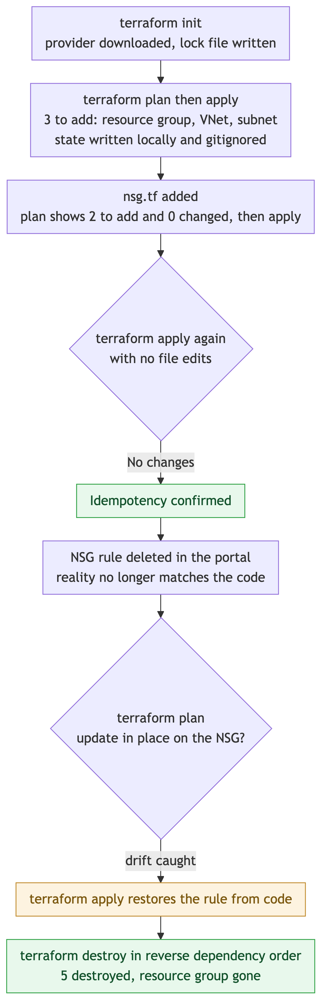

# Lab 04 - build assets (Terraform / Infrastructure as Code)

A complete, working Terraform configuration that builds a small Azure network -
resource group, VNet, subnet, and an NSG with a real rule, attached to the subnet
- from plain text files, with no `deploy.sh`: the four raw Terraform commands are
run by hand, on camera. `labs/` is gitignored - none of this is published.

## Architecture



The Terraform CLI runs locally, authenticates through the `azurerm` provider using
the Azure CLI's cached token, and talks to Azure Resource Manager - no credential
lives in any file. Everything it builds sits inside one resource group boundary,
`rg-lab04-tf-cam`: a VNet containing a subnet, with an NSG's one allow-80 rule
attached to that subnet by its own association resource. The dependency-graph
panel is the same five resources read as a chain, which is the order `apply`
creates them in and `destroy` reverses.

## How it runs



`init` downloads the provider once; every `plan` after that is a read-only
comparison of the `.tf` files against state and reality, and `apply` is the only
step that mutates anything, gated by typing the literal word `yes`. The first
apply creates three resources, a parked `nsg.tf` file is moved in to add two
more, a repeat `apply` with no edits proves idempotency by reporting no changes,
and deleting the NSG's rule in the portal is caught as drift on the next `plan`
and corrected by `apply`. `destroy` then removes all five in reverse dependency
order, verified independently against the Azure API.

Leveled up over the assignment PDF: file split instead of one `main.tf`
(providers / variables / network / nsg / outputs - Terraform reads every `.tf`
in the folder as one config), variables with defaults instead of hardcoded
names, a real allow-80 rule + subnet association on the NSG the PDF leaves
empty and floating, outputs, and a proper `.gitignore`. The PDF runs in Cloud
Shell; this runs fine either locally or there. This lab has no `deploy.sh` or
`teardown.sh` by design - the four commands below are typed by hand so the
workflow itself stays visible.

## What is here

| File | What it teaches |
|--|--|
| `terraform/providers.tf` | What a provider is, version pinning, how `az login` auth works |
| `terraform/variables.tf` | Inputs, defaults, where values come from, the `sensitive` rule |
| `terraform/network.tf` | Resource blocks, references = implicit dependencies, the RG→VNet→subnet graph |
| `terraform/nsg.tf` | Adding to a live environment, NSG rules as code, associations, `depends_on` vs references |
| `terraform/outputs.tf` | What outputs are for (humans + downstream code) |
| `terraform/terraform.tfvars.example` | The tfvars convention: example committed, real file gitignored |
| `terraform/.gitignore` | What never gets committed (state!) and why |

## Prereqs / versions

- **Terraform ≥ 1.5** - built and validated against Terraform 1.15.7, re-verified
  live end-to-end (deploy → NSG add → idempotency → drift → destroy) on 1.15.8,
  provider `azurerm ~> 3.0` (resolved 3.117.1 both times).
  Local install: `brew install hashicorp/tap/terraform` · check: `terraform version`
- **Azure CLI logged in:** `az login`, then confirm the target subscription
  with `az account show` (switch: `az account set -subscription "<name>"`).
  Terraform's azurerm provider borrows the CLI's cached token - no
  credentials go in any file.
- **Zero-install alternative:** Azure Cloud Shell (Bash) has Terraform
  preinstalled and is already authenticated. Same commands, same result.

## The four commands (from `terraform/`, always this order)

```
terraform init
terraform plan
terraform apply
terraform destroy
```

- `init` - downloads the azurerm provider plugin into `.terraform/` and
  writes `.terraform.lock.hcl` (exact version pin - commit the lock file).
  Once per project folder. 🔒 **Verify live before you actually do this in this
  checkout:** the repo-root `.gitignore`'s blanket `/labs/` rule currently
  shadows this folder's own `.gitignore` (which says to keep the lock file) -
  `git check-ignore -v` confirms it - so a plain `git add .` won't stage it;
  use `git add -f` or fix the root rule first.
- `plan` - read-only preview: compares the `.tf` files against the state
  file and shows exactly what would change. **Never skip plan.** The habit
  is the skill.
- `apply` - shows the plan again and asks for the full word `yes` (a `y`
  won't do - deliberate safety). Then creates in dependency order.
- `destroy` - reads the state file, plans the deletion of everything it
  created, asks `yes`, removes it all in reverse dependency order.

## State - the one file that matters

After the first apply, Terraform writes **`terraform.tfstate`** in this
folder. It's Terraform's memory: the real IDs and full attribute values of
everything it built. Plan/apply work by comparing code ↔ state ↔ reality.

- **Never commit it** (this folder's `.gitignore` already blocks it) - in
  real projects state holds secrets in plaintext, and two people applying
  from different states will fight over the same infrastructure. Teams put
  it in a remote backend (Azure Storage) with locking instead.
- **Never delete or hand-edit it** - Terraform forgets what it owns and
  will try to re-create things that already exist (name-collision errors).
- **Never delete Terraform-managed resources in the portal** - state still
  remembers them and the next plan errors out (drift). Fix what code
  manages by changing the code.

## Teardown (do it - then verify)

```
terraform destroy
```

Type `yes`. Expect `Destroy complete! Resources: 5 destroyed.` Then verify:
portal → Resource groups → `rg-lab04-tf-cam` is gone (allow ~30s + refresh), or

```
az group exists -name rg-lab04-tf-cam
```

→ `false`. Use `terraform destroy`, not a portal delete - destroy keeps the
state file and reality in sync (and leaves you able to rebuild the whole lab
with one `apply`, which is the entire point).

## Cost

Effectively **$0**. Resource groups, VNets, subnets, and NSGs are all free
Azure resources - nothing here meters by the hour. Destroy anyway: free
today isn't free after the next lab bolts a VM onto this network, and the
teardown habit is part of the workflow being practiced.

## Common first-timer errors

| Error | Cause → fix |
|--|--|
| `building account: could not acquire access token` / `az login` mentioned in error | Provider can't find CLI credentials → run `az login`; confirm `az account show` points at the right subscription |
| `A resource with the ID ... already exists` or RG name conflict | `rg-lab04-tf-cam` already exists (old attempt, or portal-made) → delete it in the portal first, or change `resource_group_name` in a `terraform.tfvars` |
| `terraform: command not found` | Not installed locally (`brew install hashicorp/tap/terraform`) - or a stale Cloud Shell session: close and reopen Cloud Shell |
| Plan shows `0 to add` when you expected creates | State already records the resources - they exist. Want a fresh run? `terraform destroy` first |
| `apply` fails partway (API error / quota) | Transient or subscription limit → just run `terraform apply` again; Terraform keeps what succeeded and retries only what's missing |
| `Error: Duplicate resource ... block` | Same resource pasted twice (usually a double-paste into one file) → delete the duplicate block |
| Syntax error on line N | A missing `}` or `"` - every opening `{` needs a closing `}`. `terraform fmt` and `terraform validate` catch these before plan does |
