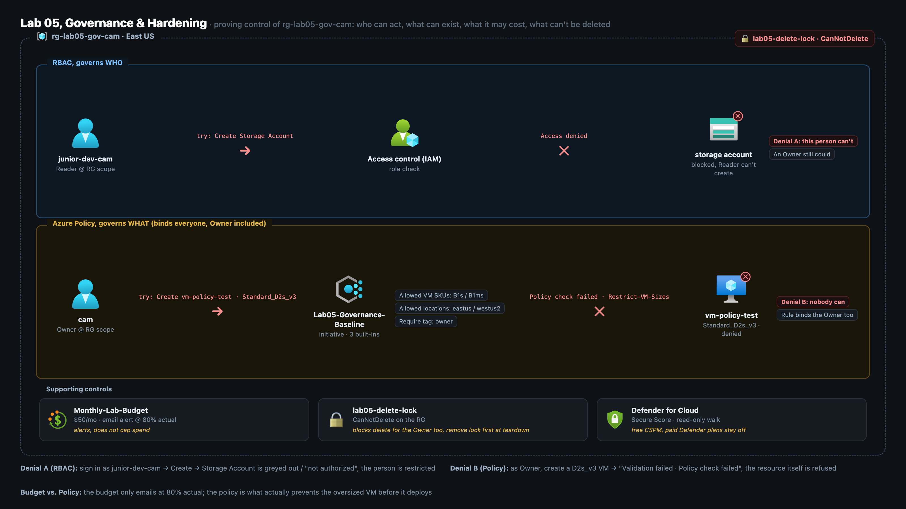
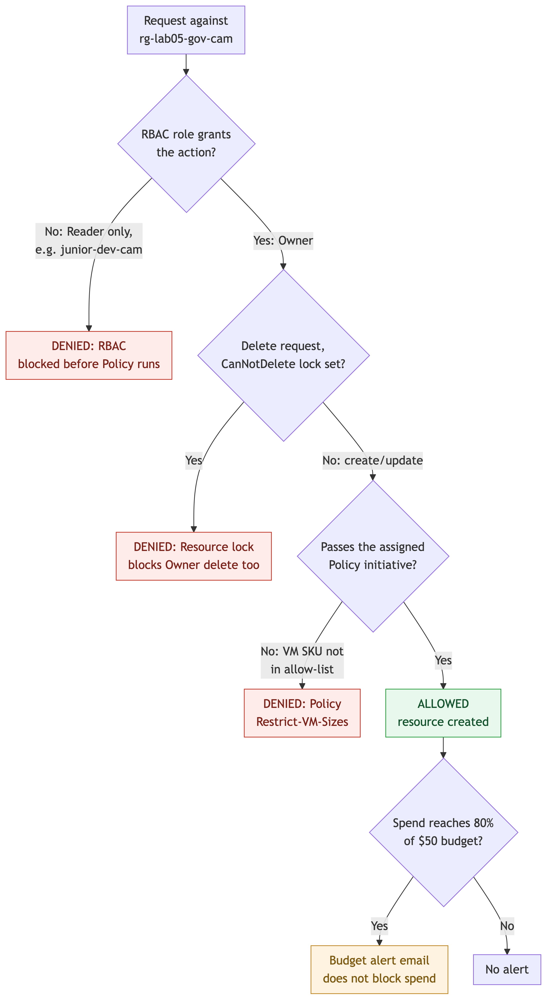

# Lab 05 - build assets (Governance & Hardening)

Deployed, one resource group (`rg-lab05-gov-cam`) is governed by five native Azure
controls at once: RBAC decides who can act, Azure Policy decides what can exist,
a budget watches what it costs, a resource lock stops it being deleted, and
Defender for Cloud reads its Secure Score.

**Watch the build:** https://youtu.be/ILB9stGsmlg

## Architecture



One resource group, two deny lanes, three supporting controls. The RBAC lane shows
`junior-dev-cam`, holding only Reader at the RG scope, failing to create a storage
account before Azure Policy is ever evaluated; the Policy lane shows the Owner,
who has every RBAC permission, still refused when creating a VM outside the
allowed SKU list, because Policy binds every identity regardless of role. The
resource-group boundary also carries the `CanNotDelete` lock, and the row below
the two lanes shows the three controls that do not gate a request in the same
way: the budget alerts at 80% of spend without blocking anything, the lock blocks
deletion specifically, and Secure Score is a read-only posture check at the
subscription level.

## How it runs



RBAC is evaluated first because it resolves immediately and blocks a request
before Policy is ever reached; a delete request against the locked resource group
is denied on its own branch regardless of who is asking; Policy runs last because
its assignment needs 15-30 minutes to propagate, and the only failure demonstrated
live is the VM-SKU rule, since the tag and location rules are deliberately
satisfied by the test VM; and once a request is allowed, spend against the $50
budget is checked separately and only ever sends an email, never blocks anything.

## What is here
- `policies/` - **teaching copies** of the policy rules, written as JSONC (JSON +
  `//` comments) so they read clean in VS Code on camera. Azure rejects comments,
  so on the shoot the built-ins are assigned through the **portal**, not pasted.
  - `allowed-vm-skus.json` - the money-shot policy: deny any VM size not in the
    allow-list (`Standard_B1s`, `Standard_B1ms`).
  - `allowed-locations.json` - deny resources outside `eastus` / `westus2`.
  - `require-tag.json` - deny any resource missing an `owner` tag.
  - `deny-public-ip.json` - **optional/advanced**, the one genuinely *custom*
    policy (no clean built-in deny exists). Not authored live; assets-only.
  - `governance-initiative.json` - bundles the three built-ins into one
    **initiative** (policy set) so it's assigned and reported as a single unit.
  - `governance-initiative.definitions.json` / `governance-initiative.params.json`
    - the **comment-free splits** of the initiative JSONC, in the exact shape
    `az policy set-definition create` expects (used by `cli/deploy-governance.sh`
    Block 4). Edit the JSONC teaching copy? Mirror the change here.
- `cli/deploy-governance.sh` - CLI fallback for the whole lab, one guardrail per
  block, each block commented with what it does. Portal is primary.
- `cli/teardown.sh` - **lock comes off FIRST**, then assignment → initiative →
  RG → user. Guarded so it can never target `rg-cloud-portfolio`.

## Cost - essentially $0
RBAC, Azure Policy, Budgets, Resource Locks, and the Defender **Secure Score**
(free foundational CSPM) are all **free**. The only thing that can bill is a VM,
and the whole demo is that the policy **refuses** to create the oversized one -
so nothing ever spins up. Do **not** enable a paid Microsoft Defender plan; the
secure-score walk uses the free tier only.

## What we do on camera (deploy order)
1. **Playground** - create `rg-lab05-gov-cam` (East US, tagged). Right now I'm
   Owner: nothing stops a \$1,000 mistake. That's the "before."
2. **RBAC** - create user `junior-dev-cam`, assign **Reader** on the RG only.
3. **Deny test #1 (money shot)** - incognito, sign in as the junior dev, try to
   create a Storage Account → **Access denied / Create greyed out**. RBAC governs
   *who*.
4. **Policy JSON walk** - read the if/then/`effect: deny` anatomy in VS Code.
5. **Initiative + assign** - bundle the three built-ins, assign to the **lab RG**
   (see scope note below). *Fallback: assign the single VM-SKU built-in - that's
   the PDF baseline.*
6. **Budget** - `Monthly-Lab-Budget`, \$50, email alert at 80% actual.
7. **Resource lock** - `CanNotDelete` on the lab RG; a delete attempt is blocked.
8. **Secure score** - read-only Defender for Cloud walk (free tier).
9. **Deny test #2 (money shot)** - as the Owner, try to create `vm-policy-test`
   at `Standard_D2s_v3` → **Validation failed · Policy check failed ·
   Restrict-VM-Sizes**. Policy governs *what*, even for admins.

> **Policy propagation:** an assignment can take **15-30 min** to fully enforce.
> On the shoot we assign in step 5, then do budget → lock → secure-score (steps
> 6-8, all quick and unrelated) to burn that clock, and run the deny test last.

## Scope note - RG, not subscription (DECIDED)
The cold-open story is subscription-wide governance, but the DENY policies are
scoped to **`rg-lab05-gov-cam` only**. A subscription-wide deny (require-tag,
allowed-locations) would also apply to anything else running in the subscription
and could block legitimate changes to it. Same reasoning as the PDF ("enforce on
the lab group, not everywhere"). The narration says "this environment," not
"every group I own." **Decision: RG-scoped.** (`rg-cloud-portfolio` was deleted
~2026-07-03 for the site redo, but the RG-scope rule stays - the rebuilt site
lands in this subscription too.)

## Cleanup - remove the LOCK first, then delete ONLY the lab group
```
# 1. Lock OFF first - it blocks its own group's deletion.
az lock delete -name lab05-delete-lock -resource-group rg-lab05-gov-cam
# 2. Then the group (kills budget, policy assignment scope, everything in it).
az group delete -name rg-lab05-gov-cam -yes -no-wait
# 3. And the throwaway user, so the directory stays clean.
az ad user delete -id junior-dev-cam@<tenant>.onmicrosoft.com
```
⚠️ **Only** `rg-lab05-gov-cam` - never anything else in the subscription. (The
old `rg-cloud-portfolio` group is deleted, but `cli/teardown.sh` keeps its guard
against it anyway.) If you added the initiative/custom definition, delete the
**assignment first**, then the set-definition, then the definition. Full sequence
in `cli/teardown.sh`.
