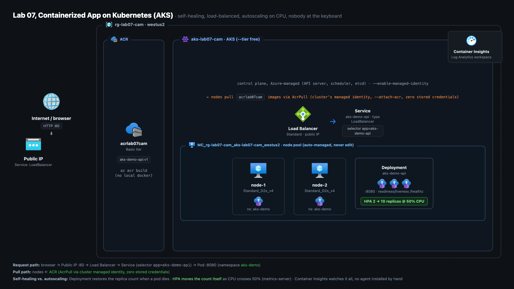
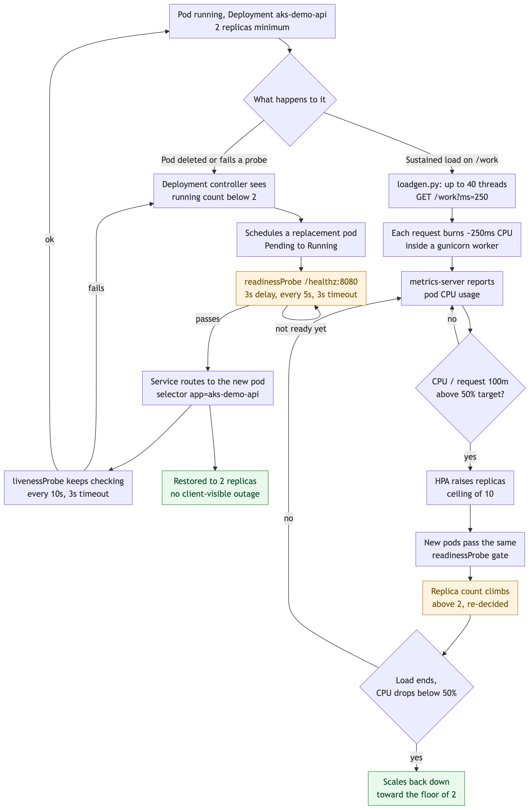

# Lab 07 - build assets

A Flask API runs on an AKS cluster behind a public Load Balancer, kept at 2 replicas
by a Deployment and autoscaled 2 to 10 on CPU by an HPA, pulling its image from a
private ACR with no stored credential.

**Watch the build:** https://youtu.be/1Bem1-eSOKE

## Architecture



The resource group `rg-lab07-cam` holds ACR and the AKS control-plane resource; the
node pool, disks, and the Standard Load Balancer sit in Azure's own auto-created
`MC_rg-lab07-cam_aks-lab07-cam_westus2` group, never edited directly. Inbound traffic
runs browser to public IP to Load Balancer to the `aks-demo-api` Service to a pod on
port 8080 in the `aks-demo` namespace, while the cluster's managed identity pulls
images from `acrlab07cam` via the `AcrPull` role with zero stored credential, and
Container Insights watches the whole cluster with no agent installed by hand.

## How it runs



Self-healing and autoscaling are shown as two branches off the same running pod. On
one side a deleted or failing pod trips the Deployment controller, which schedules a
replacement that only takes traffic after it passes the readiness probe and stays up
under the liveness probe, restoring the same 2-replica set point. On the other, a
sustained CPU load reported by metrics-server crosses the HPA's 50% target and the
Deployment's replica count is raised toward the ceiling of 10, then scaled back
toward the floor of 2 once the load ends.

## What is here

```
app/
  app.py            # the Flask API: / (who answered), /healthz (probe target),
                     # /work (CPU-burn route - what the load test hits)
  requirements.txt  # flask, gunicorn
  Dockerfile        # python:3.13-slim, non-root user, gunicorn entrypoint
k8s/
  00-namespace.yaml   # aks-demo namespace
  10-deployment.yaml  # 2 replicas, CPU/memory requests+limits, readiness+liveness probes (timeoutSeconds: 3, tuned for load)
  20-service.yaml     # type: LoadBalancer - the public door
  30-hpa.yaml         # HorizontalPodAutoscaler: 2-10 replicas, 50% CPU target
cli/
  deploy.sh    # RG -> ACR -> az acr build -> AKS -> kubectl apply -> Container Insights
  teardown.sh  # az group delete (single command tears down the whole lab)
scripts/
  loadgen.py   # stdlib-only load generator - the thing that trips the HPA on camera
```

## One-command deploy / teardown

```bash
cd assets/cli
./deploy.sh       # idempotent - safe to re-run
./teardown.sh     # one `az group delete` removes everything, including the
                   # auto-created MC_* node-resource-group
```

`deploy.sh` also registers the `Microsoft.ContainerService` / `Microsoft.
ContainerRegistry` resource providers if a fresh subscription hasn't used AKS/ACR
before - a one-time subscription flag, not a billable resource.

## Design decisions worth naming

**`az acr build` instead of local `docker build` + `docker push`.** The image
builds inside Azure Container Registry itself - no Docker daemon has to be
running on the laptop, and the registry never needs a local `docker login`.
Same result (an image sitting in ACR), one fewer moving part, and it's the
pattern you'd actually use from CI later (Lab 08 does exactly this from
GitHub Actions).

**Managed identity + `-attach-acr` instead of an ACR admin password or an
image-pull secret.** AKS gets a system-assigned identity, and `-attach-acr`
grants that identity the `AcrPull` role on the registry - one role
assignment, no credential stored in a Kubernetes Secret, nothing to rotate.
Least privilege carried forward from the earlier labs, just applied to a
cluster instead of a VM.

**CPU requests are mandatory, not decorative.** `10-deployment.yaml` sets
`resources.requests.cpu: 100m`. The HPA's "50%" target is 50% *of the
request* - skip the request and the HPA has no denominator and refuses to
scale. This is the single most common reason someone's HPA "doesn't work."

**Validation + scan gate, same discipline as the pipeline labs.** `deploy.sh`
runs `kubectl apply -dry-run=client -f "$RENDERED_DIR" -o name >/dev/null`
before touching the cluster - kubectl has no `-o none` printer (that's an
`az` CLI convention, not a `kubectl` one), so the output's redirected to
`/dev/null` instead - then best-effort `checkov` (IaC/manifest scan) and
`trivy` (container image scan) if they're installed - mirroring the
Checkov/Trivy gate Lab 08's CI pipeline runs on every PR. Neither tool is
required to deploy; both are one `brew install` away:

```bash
brew install checkov
brew install trivy
```

**One resource group holds everything.** AKS, ACR, the node pool VMs, and the
Load Balancer's public IP all live in `rg-lab07-cam` (AKS also spins up a
second, auto-managed `MC_rg-lab07-cam_aks-lab07-cam_westus2` group for the
node VMs/disks/NICs/LB - that one is Azure's, never edit it directly). One
`az group delete` on `rg-lab07-cam` takes the managed group with it.

## Where this goes next (production, not built here)

Named on camera, not deployed in this lab - real Azure/AKS features, one flag
each, worth knowing the name of:

- **Gateway API** (`-enable-gateway-api`) - Kubernetes' newer, more
  expressive routing standard; the production answer once there's more than
  one app behind this IP, alongside the older Ingress-controller pattern.
- **KEDA** (`-enable-keda`) - Kubernetes Event-Driven Autoscaling, an AKS
  add-on, once a signal other than CPU (queue depth, requests/sec) should
  drive the scale instead.
- **Node autoprovisioning** (`-node-provisioning-mode Auto`, AKS's
  Karpenter-based mode) - adds/removes whole nodes automatically once pod
  demand outgrows a fixed node count.
- **Azure Monitor managed Prometheus** (`-enable-azure-monitor-metrics`) -
  the managed version of the open-source metrics standard, layered on top of
  Container Insights. Pairs with **Azure Managed Grafana** for dashboards -
  Grafana is a separate resource (`az grafana create`) linked in with
  `-grafana-resource-id`, not something the AKS flag creates by itself.
- **Azure Policy add-on** (Gatekeeper-based admission control) - blocks a
  manifest that violates a rule (no resource limits, a privileged container)
  before it's ever scheduled.

## Verify / debug

- `kubectl get pods -n aks-demo` - two `Running` pods.
- `kubectl get svc aks-demo-api -n aks-demo` - `EXTERNAL-IP` populated (can take
  1-3 minutes after apply - Azure is provisioning a real Load Balancer + public IP).
- `curl http://<external-ip>/healthz` → `{"status": "ok"}`.
- Load test + watch it scale:
  ```bash
  python3 scripts/loadgen.py <external-ip> -seconds 180
  kubectl get hpa -n aks-demo -w      # REPLICAS climbs as CPU% crosses 50
  ```
- Logs/metrics without installing an agent: portal → the AKS cluster →
  **Insights** (Container Insights, backed by the Log Analytics workspace the
  monitoring add-on created). 🔒 not exercised end-to-end in rehearsal -
  confirm this view actually populates before relying on it live.
- If a pod won't go `Ready`: `kubectl describe pod -n aks-demo <pod>` then
  `kubectl logs -n aks-demo <pod>`. Probes already carry `timeoutSeconds: 3`
  (not the 1s k8s default) so a busy `/work` handler during the Step 7 load
  test doesn't false-fail `/healthz` and trigger a needless
  `CrashLoopBackOff`.

## Cost while running

~$5/day: 2× `Standard_D2s_v4` nodes (~$4.60/day) + ACR Basic (~$0.17/day) +
the Standard Load Balancer AKS provisions for the Service (~$0.60/day). AKS's
control plane itself is free on the `free` tier (`-tier free`, no financially
backed SLA - fine for a lab). Tear it down the same day you record.

🔒 If a pre-flight `az vm list-skus` check flags `Standard_D2s_v4` in
`westus2` as `NotAvailableForSubscription` for a zone, that's a false alarm -
this build never requests an explicit zone, so `az aks create` succeeds
regardless. Don't chase it.
