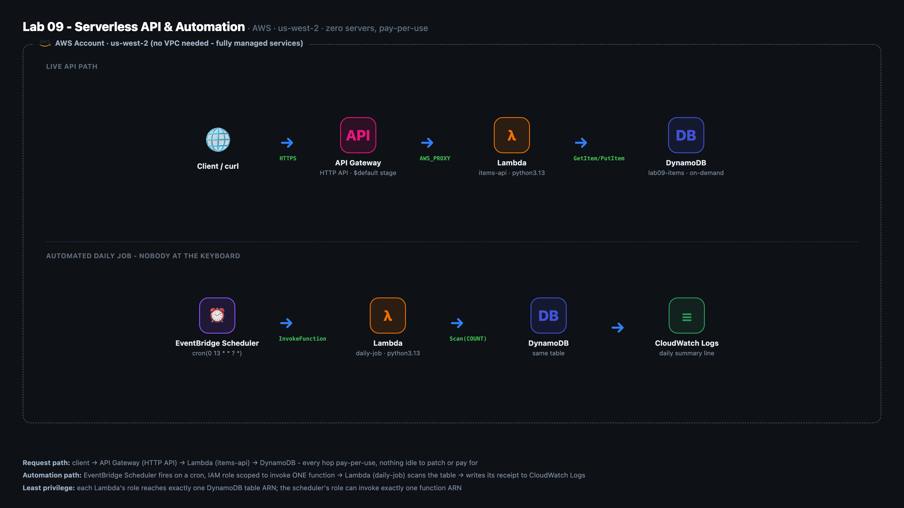

# Lab 09 assets - Serverless API & Automation

A small CRUD API (create, read, list, delete items) and a daily automated job, both fully
serverless on AWS in `us-west-2`: DynamoDB, two Lambda functions, an API Gateway HTTP API and an
EventBridge Scheduler schedule, with nothing idle to patch or pay for.

**Project card:** https://camdjackson.com/projects.html

## Architecture



Two paths share one DynamoDB table. The top path is live traffic: a client calls the HTTP API,
which hands the request to the `items-api` Lambda over an `AWS_PROXY` integration, and the
function reads or writes the `lab09-items` table. The bottom path runs with nobody at the
keyboard: EventBridge Scheduler fires `cron(0 13 * * ? *)`, invokes the `daily-job` Lambda, and
that function counts the table and writes a one-line summary to CloudWatch Logs. There is no VPC
in this build, because every piece is a managed service.

## How it runs


`deploy.sh` builds everything in dependency order: the table (with point-in-time recovery), the
Lambda execution role and its table-scoped inline policy, both functions, the HTTP API with four
routes and an auto-deploying `$default` stage, then the scheduler role and the schedule. Its last
step runs IAM Access Analyzer against both rendered policies.

After that, two things happen independently. A request to the API is routed on
`event["routeKey"]`: an unknown route gets a 404, a `POST` without a `name` gets a 400, a `GET` for
a missing id gets a 404, an unhandled exception is logged and returned as a clean 500, and
everything else returns 201, 200 or 204. Once a day at 13:00 UTC the scheduler invokes the job,
which runs `Scan(Select=COUNT)` and prints a JSON summary that lands in CloudWatch Logs.

## What is here

```
assets/
  cli/
    deploy.sh                 idempotent build, table through Access Analyzer scan
    teardown.sh               reverse-order teardown, safe to re-run
  lambda/
    items_api/index.py        the CRUD handler, one router, four routes
    daily_job/index.py        the scheduled job, logs a one-line JSON summary
  policies/
    lambda-trust-policy.json      lambda.amazonaws.com may assume the Lambda role
    scheduler-trust-policy.json   scheduler.amazonaws.com may assume the scheduler role
    items-table-policy.json       JSONC teaching copy, four DynamoDB verbs on one table ARN
    scheduler-invoke-policy.json  JSONC teaching copy, lambda:InvokeFunction on one function ARN
  diagram/
    architecture.html / .png  the architecture diagram
    make-diagram.py           regenerates it with headless Chrome
    flowchart.mmd / .png      the deploy and runtime flowchart (Mermaid source + render)
    full-story/
      make-architecture-animation.py   renders a staged, animated version of the diagram
```

The two JSONC policy files carry `//` comments, which real IAM rejects. `deploy.sh` strips the
comments, fills in the real table or function ARN, and writes the clean policy to `.build/`.

## Deploy

Prerequisites: the AWS CLI v2 with credentials for an account where you can create IAM roles,
plus `python3` and `zip` on your path.

```bash
cd labs/lab-09/assets
./cli/deploy.sh
```

The script is idempotent: every step checks whether the resource already exists and skips or
updates it. The region is hardcoded to `us-west-2` at the top of both scripts. When it finishes
it prints the API endpoint and two `curl` commands to try it:

```bash
curl -s -X POST <endpoint>/items -d '{"name":"first item"}'
curl -s <endpoint>/items
```

To prove the job without waiting for 13:00 UTC, invoke it directly and read the summary:

```bash
aws lambda invoke --function-name lab09-daily-job --region us-west-2 \
  --cli-binary-format raw-in-base64-out /tmp/lab09-job-out.json
cat /tmp/lab09-job-out.json
```

The same JSON line shows up in the `/aws/lambda/lab09-daily-job` log group.

## Teardown

```bash
cd labs/lab-09/assets
./cli/teardown.sh
```

Deletes, in order: the schedule, the HTTP API, both Lambda functions, both IAM roles (policies
detached and deleted first), the DynamoDB table and the two log groups, then removes the local
`.build/` folder. Every command is guarded with `|| true`, so a partial deploy or a repeat run
never fails hard. Nothing outside the `lab09-*` names is touched.

## Cost

Everything here is pay-per-use, so idle cost is close to zero.

| Service | Billing | Idle cost |
|---|---|---|
| DynamoDB (`PAY_PER_REQUEST`) | per read/write request | $0, no provisioned capacity |
| DynamoDB point-in-time recovery | continuous backup storage | about $0 at this data volume |
| Lambda (both functions) | per millisecond, per invocation | $0 between invocations |
| API Gateway (HTTP API) | per request | $0 between requests |
| EventBridge Scheduler | per invocation triggered | $0 between fires (one a day) |
| CloudWatch Logs (14-day retention) | per GB ingested and stored | pennies at this log volume |

Nothing has an hourly meter. I still tear it down when I'm done, because the habit matters more
than the dollars.

## Design decisions worth saying out loud

**Least privilege over the AWS-managed policy.** AWS ships `AWSLambdaDynamoDBExecutionRole`,
which grants the same DynamoDB verbs on every table in the account. It is one line to attach and
this build does not use it. `deploy.sh` renders a custom inline policy with exactly the four verbs
the handlers call (`GetItem`, `PutItem`, `DeleteItem`, `Scan`) scoped to the ARN of the one table
this app owns. If the function were compromised, or its code changed to reach for a different
table, IAM would refuse it. The scheduler role gets the same treatment: it can invoke exactly one
function ARN, not `lambda:InvokeFunction` on `*`.

**One function, one router.** The HTTP API uses payload format 2.0, which carries the exact route
that matched in `event["routeKey"]`. The handler looks that up in a dictionary of four routes, so
one Lambda serves create, read, list and delete without four separate functions or string parsing
on the raw path.

**Base64 bodies are decoded before parsing.** API Gateway HTTP APIs base64-encode the body and set
`isBase64Encoded` whenever the request's `Content-Type` is not one it treats as text, which
includes curl's default for `-d`. The handler checks the flag and decodes first, so a plain
`curl -d` works.

**Reliability and log hygiene, set explicitly.** Point-in-time recovery is turned on as soon as the
table is active: continuous backups, restore to any second in the last 35 days. Both functions use
Lambda's Advanced Logging Controls (`LogFormat=JSON`), and their log groups are created up front
with a 14-day retention instead of the account default of never expiring. Neither changes what the
app does. Both are what a production review would ask for.

**IAM Access Analyzer as the security scan.** There is no Terraform or container image here, so
Checkov and Trivy have nothing to point at. The equivalent for hand-written IAM JSON is
`aws accessanalyzer validate-policy`, AWS's own linter for identity policies. `deploy.sh` runs it on
both rendered policies and prints any finding above the `SUGGESTION` level. Both validate clean.

## Security posture

- No long-lived credentials in the code. Each Lambda gets its table name from an environment
  variable and its permissions from its execution role.
- The Lambda role can call four DynamoDB actions on one table ARN, plus the AWS-managed basic
  execution policy for writing its own logs.
- The scheduler role can be assumed only by `scheduler.amazonaws.com` and can invoke only the
  daily-job function.
- API Gateway's permission to invoke the items function is a resource policy scoped to this API's
  execute-api ARN.
- Errors are logged in full but returned to the caller as a generic 500, so internals do not leak
  in responses.

## What I'd do differently in production

- The HTTP API has no authorizer, so anyone with the URL can create and delete items. Production
  gets a JWT authorizer (Cognito or another OIDC provider) or IAM auth, plus throttling on the stage.
- The build is imperative AWS CLI. Production would express it as Terraform or AWS SAM with remote
  state, so drift is visible and changes go through review.
- `GET /items` is a `Scan` with `Limit=50` and no pagination. A real list endpoint would page with
  `LastEvaluatedKey`, and access patterns beyond "by id" would get a key design or index to match.
- The daily job only logs a count. A real job would send its report or do its cleanup, with a
  dead-letter queue and a retry policy on the schedule target and an alarm if it stops running.
- Encryption at rest uses DynamoDB's default AWS-owned key. A regulated workload would use a
  customer-managed KMS key.
